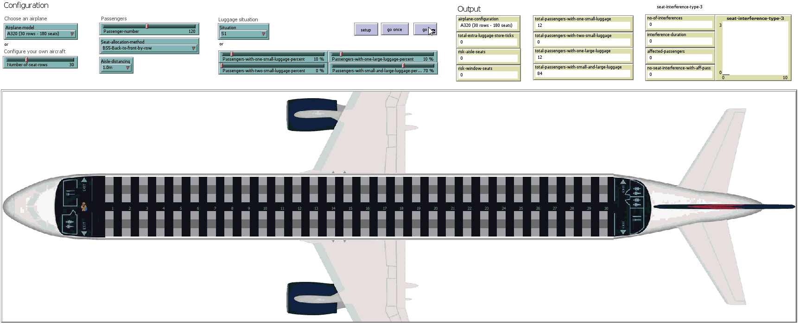
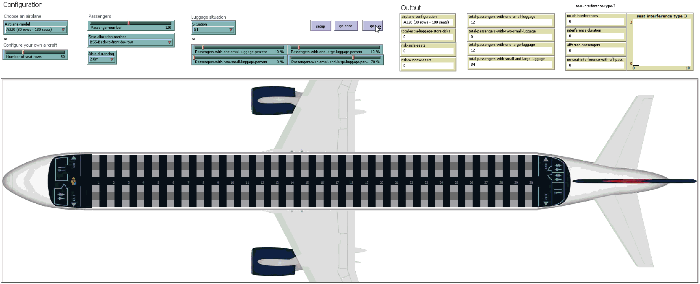

Recordings of the simulations presented in 
### **"Airplane Boarding Methods that Reduce Risk from  COVID-19"** 
submitted to the `Safety Science` journal. 

Please feel free to contact us at liviu.cotfas at ase .ro for further details. 

## Boarding Scenarios

All the simulations have been performed using the following settings:
- occupancy level: 100% (120 passengers);
- luggage situation: S1 (described in our paper).

> Suggestions: 
> 1. You can download the animations below in order to watch them at a higher resolution.
> 2. Click on the animations to view the associated video on YouTube.

### Baseline 1: Back-to-front by row
#### Aisle distancing: 1.0m

#### Aisle distancing: 2.0m

### Baseline 2: Modified reverse pyramid half zone
#### Aisle distancing: 1.0m

#### Aisle distancing: 2.0m

### Back-to-front by row – WilMA
#### Aisle distancing: 1.0m

#### Aisle distancing: 2.0m

### Back-to-front by row – WilMA – offset 2
#### Aisle distancing: 1.0m

#### Aisle distancing: 2.0m

